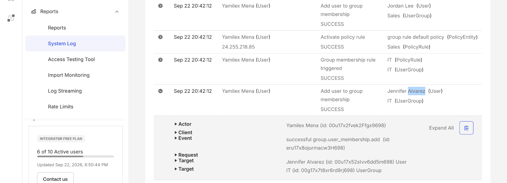

# Audit Logs in Okta

## Objective

Review Okta System Log activity to verify administrative actions and understand how audit events can support monitoring, troubleshooting, and compliance.

## Step 1: Review an Audit Event

Reviewed the Okta System Log and expanded a successful group membership event. The event details identify the administrator who performed the action, the event type, and the affected user and group.

## Skills Demonstrated

- Okta Administration
- Audit Log Review
- IAM Monitoring
- Administrative Activity Tracking
- Troubleshooting
- Compliance Awareness
